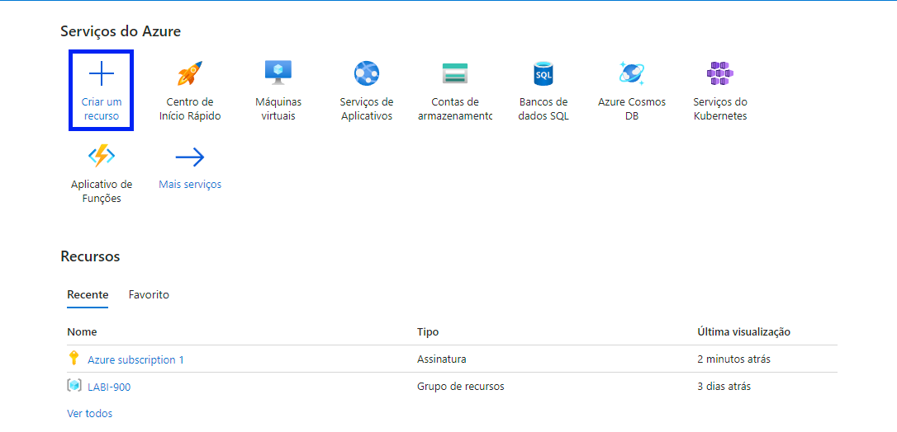
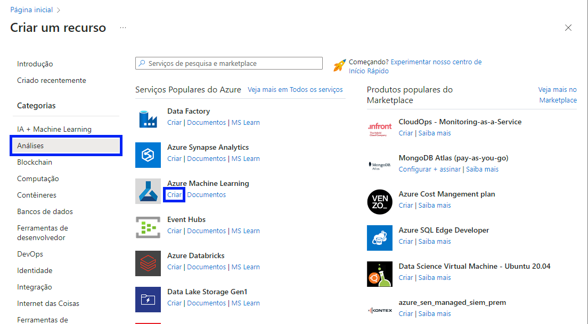
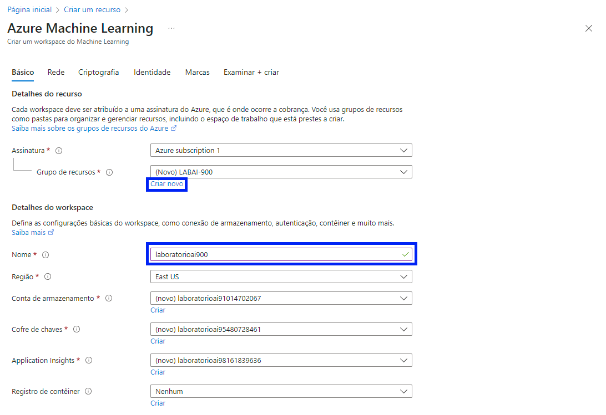
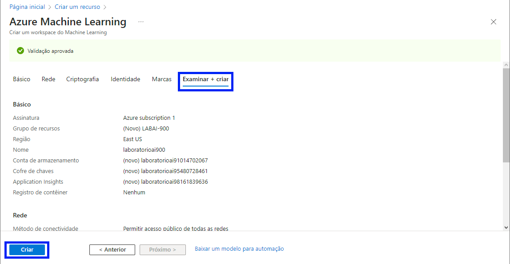
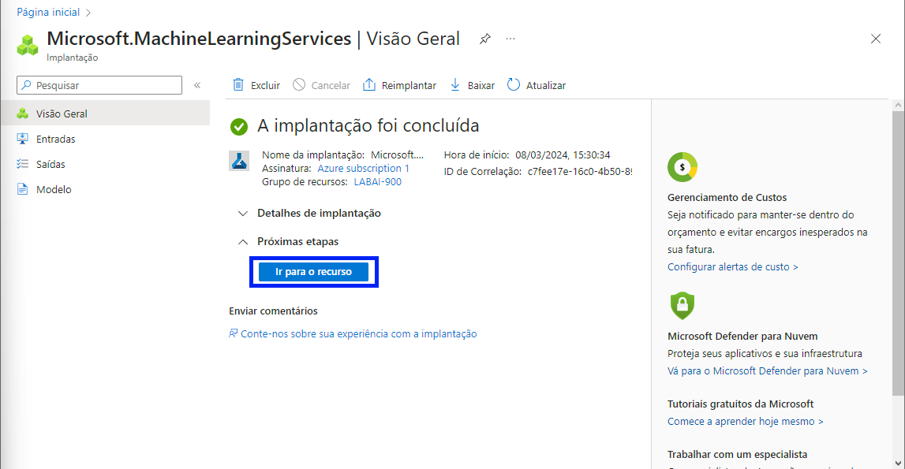
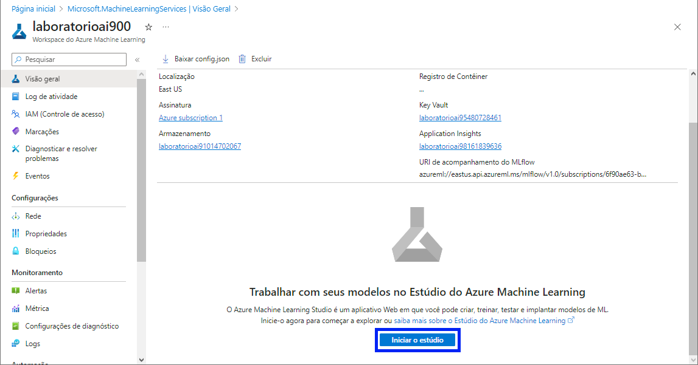

# Azure Machine Learning

Este projeto foi desenvolvido com o propósito de exemplificar a aplicação do Machine Learning na plataforma Azure, proporcionando insights valiosos a partir de dados específicos armazenados em um banco de dados. Através dessa abordagem, exploramos as capacidades da tecnologia para extrair informações relevantes e impulsionar tomadas de decisão fundamentadas.

Links utilizados no projeto:
| [Explore Azure AI Services](https://microsoftlearning.github.io/mslearn-ai-fundamentals/Instructions/Labs/02-content-safety.html) | [Explore Automated Machine Learning in Azure Machine Learning](https://microsoftlearning.github.io/mslearn-ai-fundamentals/Instructions/Labs/01-machine-learning.html) |

# 1 - Criando um recurso 
Na tela inicial você vai clicar em ***Criar um recurso***, na barra de ***Categorias*** você vai clicar em ***Análises*** e depois clicar no botão ***Criar***.

- Caso você não tenha um ***Grupo de recursos*** click em ***Criar novo*** e nomeie como ***LABAI-900***, agora escreva ***laboratorioai900*** no campo ***Nome***.

Após esse processo click em ***Examinar + criar***. Caso aparesa ***Validação aprovada*** é só clikar no botão ***Criar***

Agora que a implantação foi concluída clique em ***Ir para o recurso***

Depois clique em ***Iniciar o estúdio***

# Configurando o Modelos e Conjuntos de Dados

Nessa pagina vamos clicar em ***ML automatizado***

imagem 7

Vamos criar um ***Novo trabalho de ML automatizado***

imagem 8

Nomear alguns campos como ***Nome do trabalho***, "mslearn-bike-automl". ***Novo nome do experimento***, ""mslearn-bike-rental"". ***Descrição***, "Aprendizado de máquina para previsão de aluguel de bicicletas.". Depos desse processo iremos clicar em ***Avançar***

imagem 9

No campo ***Selecionar tipo de tarefa*** vamos selecionar **Regressão** e clicar em ***Criar***

imagem 10

Nomear alguns campos como ***Nome***, "alugueldebicicletas". ***Descrição***, ""dados históricos de aluguel de bicicletas"". ***Tipo***, "Tabular.". Depos desse processo iremos clicar em ***Avançar***

immagem 11

Selecionar ***De arquivos da Web***

imagem 12

Inserir ***URL da Web***, "https://aka.ms/bike-rentals". Depos desse processo iremos clicar em ***Avançar***

imagem 13

Modificar ***Cabeçalhos da coluna*** por **Somente os arquivos têm os mesmos cabeçalhos**. Depos desse processo iremos clicar em ***Avançar***

imagem 14

Nessa parte do processo "**Esquema**" não tem alteração, então só iremos clicar em ***Avançar***

Para finalizar o processo "**Examinar**", iremos clicar em ***Criar***

Selecionar **alugueldebicicletas**. Clicar em ***Avançar***

imagem 15

Na ***Coluna de destino*** vamos selecionar **retals (integer)**. Clicar em ***Exibir definições de configuração adicionais***. Desabilitar **Explicar o melhor modelo** e **Usar todos os modelos suportados**. Em ***Modelos permitidos***, selecionar **RandomForest** e **LightGBM**. Clicar em ***Salvar***.

imagem 16

No Campo ***Limites*** vamos inserir os seguintes números | 3 | 3 | 3 | 0.085 | 15 | 15 | e selecionar a opção **Habilitar encerramento antecipado**. Em ***Validar e testar*** selecione **Divisão de validação de treinamento** e insira o numero **10** na campo de ***Validação de percentual de dados. Clicar em ***Avançar***.

imagem 17

Nessa parte do processo "**Computação**" não tem alteração, então só iremos clicar em ***Avançar***

Para finalizar o processo "**Examinar**", iremos clicar em ***Enviar trabalho de treinamento***

Aguardar uma média de 15 min para finalizar a validação 

